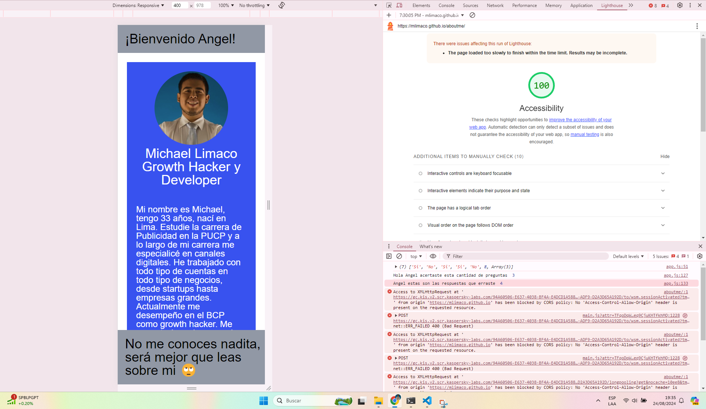

# aboutme

## About Me Adivinanza

Esta app fue construida con el propósito de que sus usuarios puedan conocer más de mí como parte del Laboratorio Clase 2 del curso 201 del Programa de Desarrollo de Software de Enter Tech School. 

### Autor: Michael Límaco

### Enlaces y Recursos

* [Referencia Readme](https://entertechschool.github.io/code-201-guide/curriculum/class-02/README-template.html)
* [Referencia Proyecto](https://github.com/entertechschool/lima-code-201n3/tree/main/class-02/demo/in-class)
* Cualquier enlace que hayas usado como referencia

### Puntuación de Accesibilidad de Lighthouse

* Propociona una captura de pantalla de tu puntuación después de ejecutar un informe de Accesibilidad de Lighthouse.
En el update del laboratorio 03 la accesibilidad se mantiene en 100 ptos.
En el update del laboratorio 05b la accesibilidad se mantiene en 100 ptos.

### Reflexiones y Comentarios

* Considera incluir las respuestas a las preguntas a tu registro de aprendizaje y de tus envíos previos
* Este también es un buen lugar para reflexionar sobre las herramientras y recursos que utilizaste y aprendiste
* Se agregaron preguntas con respuestas random y una de múltiples. 
* Se arregló el contador de puntos. 
* Se agregó biografía al HTML. 
* Se agregó la funcion de numero random para el array de respuestas.
* Se agregó el array de colores dentro del array de respuestas. 
* Se optimizó el código para poder funcionar el loop con las respuestas index 05 y 06.
* Se agregó textos en la cabecera y pie de página que cambia en relación al nombre del usuario (si ingresado) y a la cantidad de respuestas correctas. 
* El esfuerzo fue bastante elevado, particularmente loopear dentro de loops y trabajar casuisticas es bastante complejo. 
* Se agregó mejoras en el CSS. 
* Se agregó colores a los elementos. 
* Se eliminaron todos los comentarios.
* Se eliminaron todos los console log excepto los requeridos como parte de los ejercicios. 