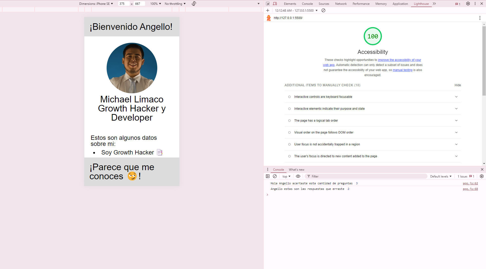

# aboutme

## About Me Adivinanza

Esta app fue construida con el propósito de que sus usuarios puedan conocer más de mí como parte del Laboratorio Clase 2 del curso 201 del Programa de Desarrollo de Software de Enter Tech School. 

### Autor: Michael Límaco

### Enlaces y Recursos

* [Referencia Readme](https://entertechschool.github.io/code-201-guide/curriculum/class-02/README-template.html)
* [Referencia Proyecto](https://github.com/entertechschool/lima-code-201n3/tree/main/class-02/demo/in-class)
* Cualquier enlace que hayas usado como referencia

### Puntuación de Accesibilidad de Lighthouse

* Propociona una captura de pantalla de tu puntuación después de ejecutar un informe de Accesibilidad de Lighthouse.

### Reflexiones y Comentarios

* Considera incluir las respuestas a las preguntas a tu registro de aprendizaje y de tus envíos previos
* Este también es un buen lugar para reflexionar sobre las herramientras y recursos que utilizaste y aprendiste